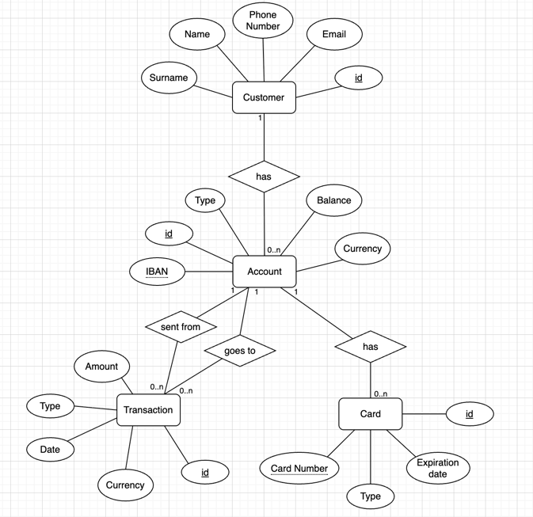
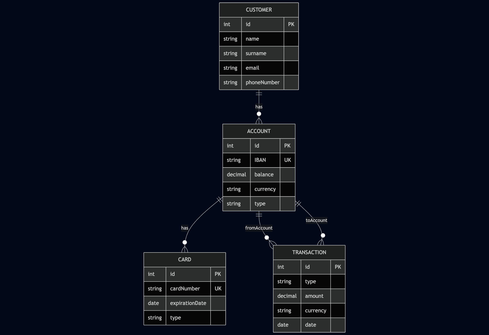
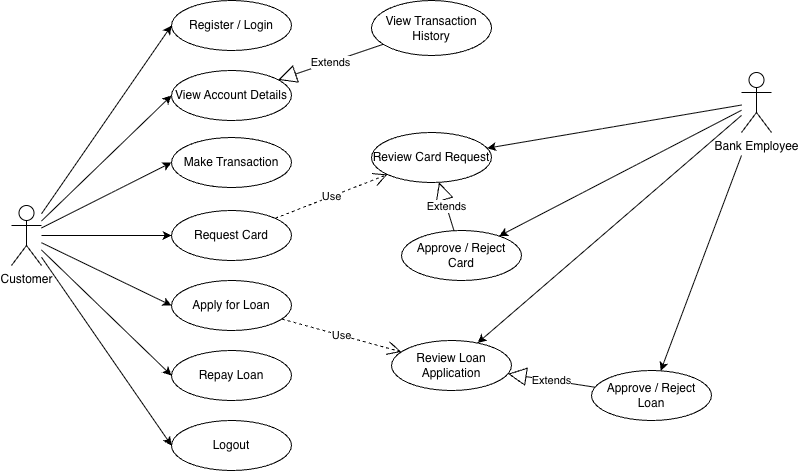
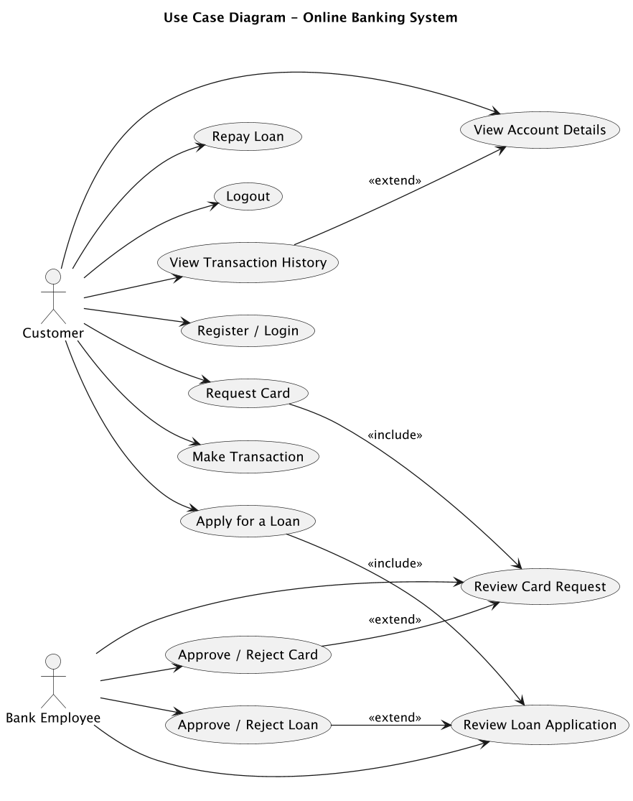

# KPI Labs — Simple Banking System

### Навігація між лабораторними
- [**Lab 1 — Entity Relationship Diagram (ERD)**](#kpi-lab1-entity-relationship)
- [**Lab 2 — Use Case Diagram (UML)**](#kpi-lab2-use-case-diagram)

## KPI Lab1 (Entity Relationship)

This project demonstrates **Entity-Relationship (ER) modeling** for a simple banking system.  
Implemented in Java classes.

## Table of Contents
1. [Chen Diagram](#1-chen-diagram)
2. [Crow’s Foot Diagram](#2-crows-foot-diagram)
3. [Declarative Model (Mermaid)](#3-declarative-model-mermaid)
4. [Model in Code (Java)](#4-model-in-code-java)

## 1. Chen Diagram
Entity-Relationship diagram using **Chen notation**.

Alternative version:  
[View V1](er_diagrams/сhen/BankSystemChen.drawio.png)

---

## 2. Crow’s Foot Diagram
Entity-Relationship diagram using **Crow’s Foot notation**.

Alternative version:  
[View V1](er_diagrams/сrowsFoot/BankSystemCrowsFoot.drawio.png)

---

## 3. Declarative Model (Mermaid)
The same model written in **Mermaid syntax**.

Source: [BankSystem.mmd](er_diagrams/mermaid/BankSystem.mmd)

Diagram preview:  

---

## 4. Model in Code (Java)
The ER model represented as Java classes.

- [Customer.java](models/Customer.java)
- [Account.java](models/Account.java)
- [Card.java](models/Card.java)
- [Transaction.java](models/Transaction.java)

## KPI Lab2 (Use Case Diagram)

## Зміст
1. [Графічна діаграма (Draw.io)](#1-графічна-діаграма-drawio)
2. [Декларативна модель (PlantUML)](#2-декларативна-модель-plantuml)
3. [Функціональні вимоги](#3-функціональні-вимоги)
4. [Нефункціональні вимоги](#4-нефункціональні-вимоги)
5. [Матриця трасування (Requirements ↔ Use Cases)](#5-матриця-трасування-requirements--use-cases)
6. [Легенда Use Cases](#6-легенда-use-cases)

## 1. Графічна діаграма (Draw.io)

## 2. Декларативна модель (PlantUML)

Файл: [use_case_diagram.puml](use_case/plantUML/BankSystemUseCase.puml) 

## 3. Функціональні вимоги

| ID | Вимога | Опис |
|----|---------|------|
| REQ1 | Реєстрація / вхід до системи | Система повинна дозволяти користувачу створити новий обліковий запис або увійти до вже існуючого, забезпечуючи автентифікацію та перевірку даних. |
| REQ2 | Перегляд деталей рахунку | Користувач може переглядати інформацію про свої банківські рахунки, включно з балансом, номером рахунку та типом рахунку. |
| REQ3 | Перегляд історії транзакцій | Користувач має можливість переглядати список попередніх операцій (дата, сума, тип операції, одержувач). |
| REQ4 | Виконання транзакцій | Система повинна забезпечувати можливість здійснення переказів коштів між власними або сторонніми рахунками користувача. |
| REQ5 | Запит на випуск картки | Користувач може створити запит на отримання нової банківської картки через систему. |
| REQ6 | Розгляд запиту на картку | Працівник банку повинен мати змогу переглядати всі подані запити на випуск карток. |
| REQ7 | Схвалення / відхилення картки | Працівник банку має можливість схвалити або відхилити запит на випуск картки після перевірки даних. |
| REQ8 | Подання заявки на кредит | Користувач може подати заявку на отримання кредиту, вказавши суму, термін та мету використання коштів. |
| REQ9 | Розгляд заявки на кредит | Працівник банку розглядає подані заявки на кредит, перевіряючи кредитоспроможність клієнта. |
| REQ10 | Схвалення / відхилення кредиту | Працівник банку може приймати рішення щодо схвалення або відмови у кредиті. |
| REQ11 | Погашення кредиту | Користувач має змогу здійснювати платежі для погашення кредиту через систему. |
| REQ12 | Вихід із системи | Користувач повинен мати змогу безпечно завершити сеанс роботи, щоб запобігти несанкціонованому доступу. |

---

## 4. Нефункціональні вимоги

| ID | Вимога                                                                                                                                                |
|----|-------------------------------------------------------------------------------------------------------------------------------------------------------|
| REQ13 | Усі дані користувачів повинні передаватися у зашифрованому вигляді.                                                                                   |
| REQ14 | Система повинна бути доступною не менше ніж 99% часу протягом місяця.                                                                                 |
| REQ15 | Час обробки транзакцій не повинен перевищувати 2 секунд.                                                                                              |
| REQ16 | Інтерфейс має бути інтуїтивно зрозумілим, адаптивним для мобільних пристроїв.                                                                         |
| REQ17 | У разі збою система повинна відновлювати роботу не пізніше ніж за 1 хвилину після збою. Допускається втрата даних не більше ніж за останні 10 хвилин. |
| REQ18 | Архітектура системи має підтримувати збільшення кільк                                                                                                 |

---

## 5. Матриця трасування (Requirements ↔ Use Cases)

| REQ / UC | UC1 | UC2 | UC3 | UC4 | UC5 | UC6 | UC7 | UC8 | UC9 | UC10 | UC11 | UC12 |
|-----------|------|---|---|---|----|----|----|---|----|----|----|----|
| REQ1 | X | X | X | X | X  | X  | X  | X | X  | X  | X  |  X |
| REQ2 |  | X | X |   |    |    |    |   |    |    |    |    |
| REQ3 |  |   | X |   |    |    |    |   |    |    |    |    |
| REQ4 |  |   |   | X |    |    |    |   |    |    | X  |    |
| REQ5 |  |   |   |   | X  |    | X  |   |    |    |    |    |
| REQ6 |  |   |   |   |    |    | X  | X |    |    |    |    |
| REQ7 |  |   |   |   |    |    |    | X |    |    |    |    |
| REQ8 |  |   |   |   |    | X  |    |   | X  |    |    |    |
| REQ9 |  |   |   |   |    |    |    |   | X  | X  |    |    |
| REQ10 |  |   |   |   |    |    |    |   |    | X  |    |    |
| REQ11 |  |   |   | X |    |    |    |   |    |    | X  |    |
| REQ12 |  |   |   |   |    |    |    |   |    |    |    | X  |

---

### 6. Легенда Use Cases

| Код UC | Назва сценарію |
|---------|----------------|
| UC1 | Register / Login |
| UC2 | View Account Details |
| UC3 | View Transaction History |
| UC4 | Make Transaction |
| UC5 | Request Card |
| UC6 | Apply for a Loan |
| UC7 | Review Card Request |
| UC8 | Approve / Reject Card |
| UC9 | Review Loan Application |
| UC10 | Approve / Reject Loan |
| UC11 | Repay Loan |
| UC12 | Logout |
